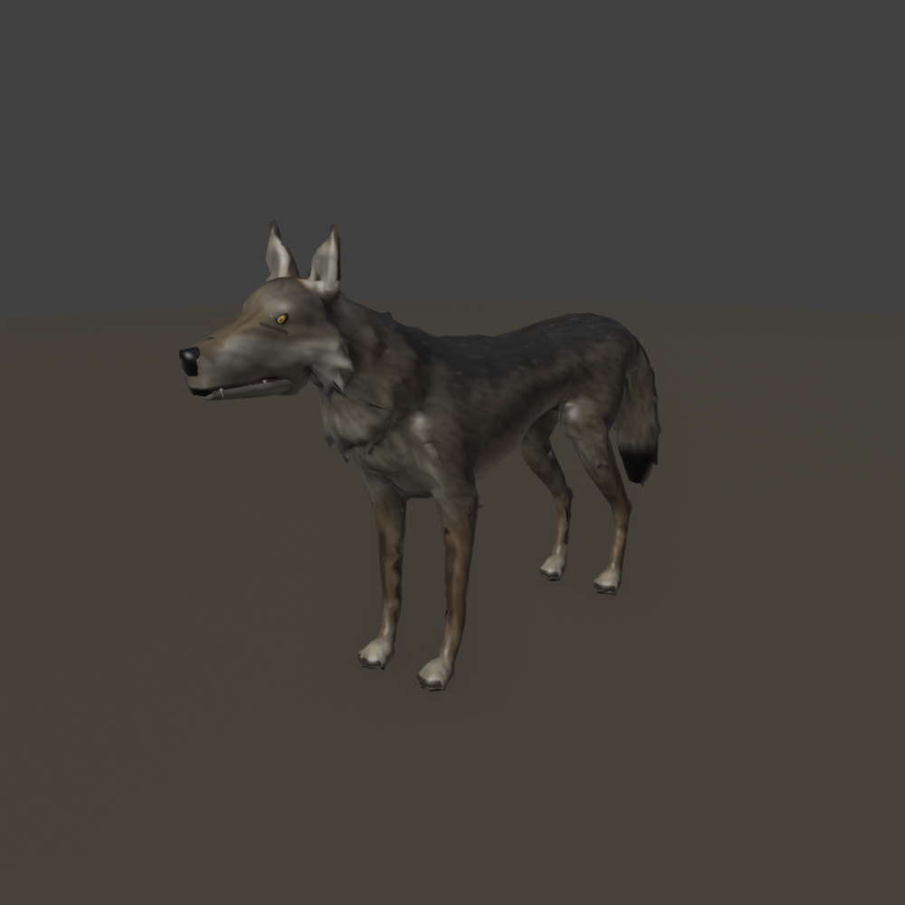
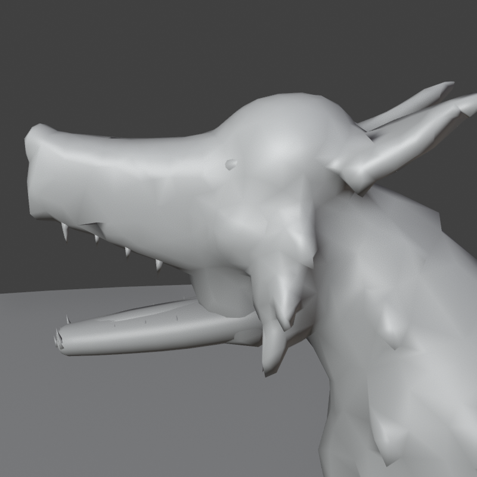
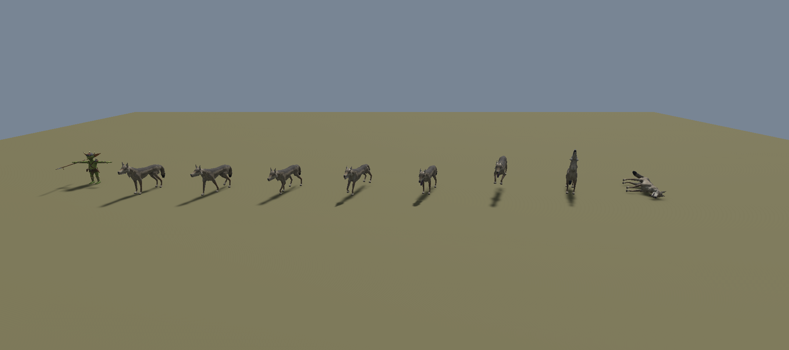
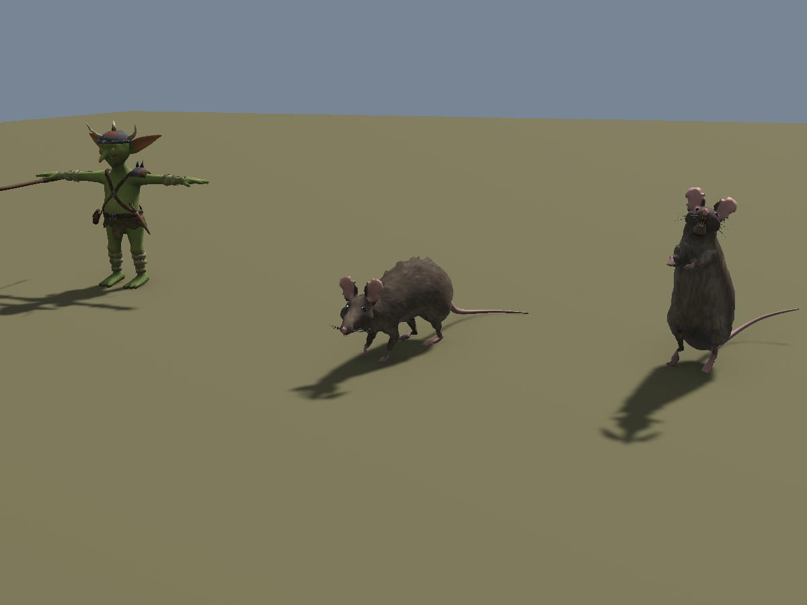
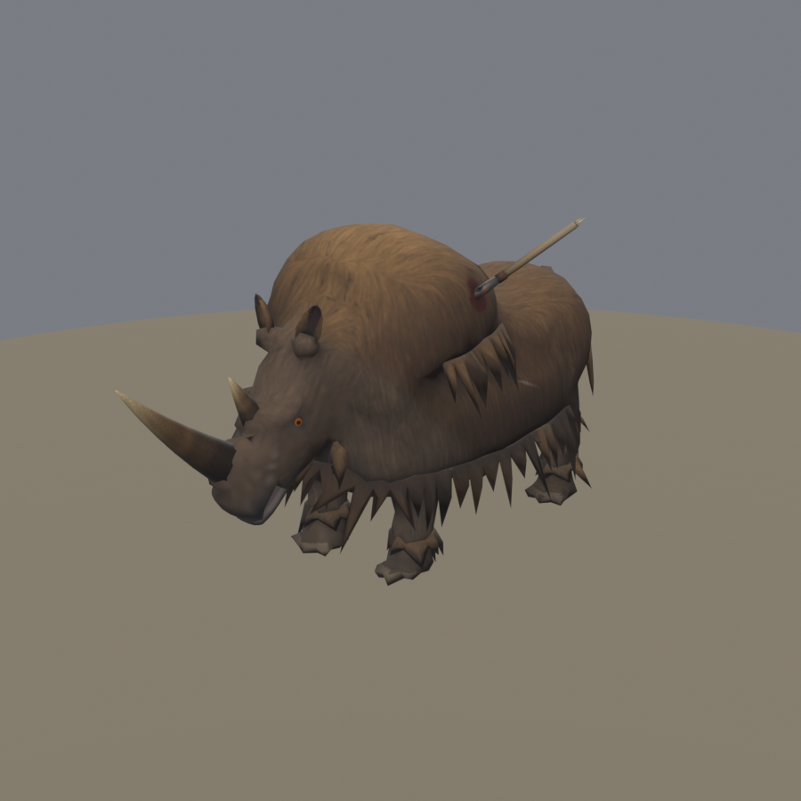
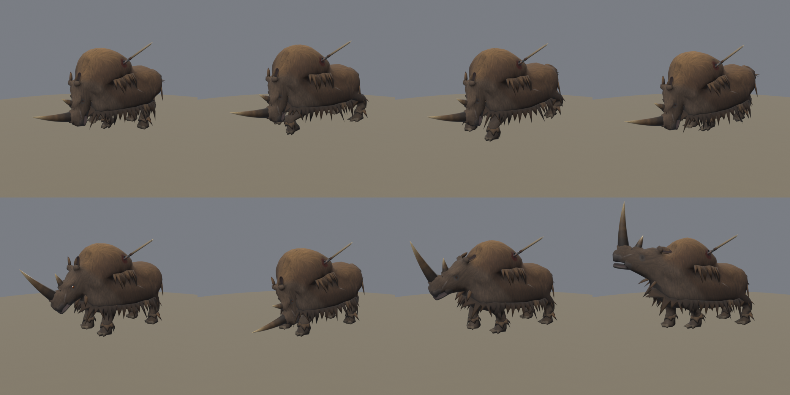

# Beasts

Enemy animals for the colony sim / RPG, built procedurally in Blender like the goblins and insectoids. Both are installed
in Unity (MedievalSetting, `Assets/Beasts`), with shared code in the `beast_*` modules:

- the **grey wolf**: model, rig, three coats and 12 clips;
- the **giant rat**: model, rig, three coats and 10 clips (see [Giant rat](#giant-rat));
- the **woolly rhino**, the woods' solo boss: model, rig, one coat, a removable spear and 13 clips (see
  [Woolly rhino](#woolly-rhino)).



Blender file: `blender/beasts.blend`, scenes **Wolf**, **Rat** and **Rhino**. It is not in the repo, and neither are `export/`,
`textures/` or `renders/`. Everything in them is rebuilt from `src/`, starting from any Blender file.

## Rebuild

In Blender (Python console or the MCP). `show()` creates the creature's scene if needed and puts it on screen. Run
it in its own call before `build_all()`: a scene switch applies only after the call returns.

```python
import sys; sys.path.insert(0, r"E:\Unity\Projects\GameArtGeneration\Beasts\src")
import wolf_build
wolf_build.show()
wolf_build.build_all()     # body -> rig -> weights -> UVs -> 3 painted coats -> 12 clips (~40 s)
wolf_build.export()        # export/Wolf.fbx, Textures/T_Wolf*.png, Anims/Wolf@<clip>.fbx + wolf_clips.json

import wolf_anim
wolf_anim.use("Lunge")     # preview a clip on the rig (the skeleton plays in place; Motion carries the travel)
wolf_anim.clear()          # back to the bind pose
wolf_build.show()          # Wolf scene on screen, material preview

import rat_build
rat_build.show()           # the Rat scene on screen (in its own call: the switch applies after the call returns)
rat_build.build_all()      # (~35 s)
rat_build.export()         # export/Rat.fbx, Textures/T_Rat*.png, Anims/Rat@<clip>.fbx + rat_clips.json

import rhino_build
rhino_build.show()         # the Rhino scene on screen (in its own call)
rhino_build.build_all()    # body -> rig -> weights -> UVs -> coat -> spear split off -> 13 clips (~40 s)
rhino_build.export()       # export/Rhino.fbx (RhinoBody + Spear), Textures/T_Rhino.png, Anims/Rhino@<clip>.fbx + rhino_clips.json
rhino_build.build_model()  # just the model (body, rig, weights, UVs, coat; the spear still joined), for iterating
```

Builds are not bit-identical from run to run: the voxel remesh varies slightly, which moves the decimated mesh and
the UVs. Always export after a rebuild, so the FBX and the textures in `textures/` match.

| Script | Does |
|---|---|
| `wolf_body.py` | Landmarks, parts (lofts and ellipsoids), stylised fur tufts, voxel fuse, crease fillet, face sculpt, decimation; the lower jaw, tongue, teeth and eyes as separate pieces; `rest_bones()` |
| `wolf_rig.py` | Heat-map skinning, rigid jaw/tongue/teeth/eyes, jowls that follow the jaw, a stress-test pose |
| `wolf_paint.py` | Seams and unwrap; per-texel painted coats (grey, black, white) |
| `wolf_anim.py` | Clips keyed from computed bone matrices: trunk/spine/neck/tail bends, 2-bone leg IK + pastern/hock angle, gaits |
| `rat_body.py`, `rat_rig.py`, `rat_paint.py`, `rat_anim.py`, `rat_build.py` | The same for the giant rat; the tail is a separate ringed shell weighted along its length |
| `beast_body.py` | Mesh helpers and the body pipeline: `fuse_body` (voxel fuse, fillet, sculpts, decimate, edge flips, fold relaxing), `build_tufts`, `sculpt_fur`, `join_pieces` |
| `beast_paint.py` | Seams from the skin weights plus the creature's cuts, unwrap (with a guard against blown-up degenerate islands), data bakes, fur strokes, texture writing |
| `beast_anim.py` | Species, Pose, leg IK, gaits (walk, trot, gallop, bound), tail drag, key tracks, clip keying, `ground_report` |
| `beast_rig.py` | Armature from a bone table (Generic rig), heat-map skinning, pose maths for keyed clips (from the insectoids) |
| `beast_scene.py`, `beast_common.py` | Cameras, lights, renders; lofts, noise, gutter fill (from the insectoids) |
| `beast_export.py` | FBX for Unity |

## Budget (colony camera, ~40 m at 50°, no LODs)

| Part | Triangles |
|---|---|
| Fur body (incl. nose) | ~4,000 |
| Lower jaw, tongue | 392, 108 |
| Teeth, eyes | 232, 120 |
| **Wolf** | **4,851** |

One material, one 1024² texture: RGB is colour and A is smoothness (URP Lit: Smoothness Source = Albedo Alpha).
The coats are `T_Wolf` (grey/timber), `T_Wolf_Black` and `T_Wolf_White`, all on the same UVs.

Size: 1.71 m nose to tail tip, 0.78 m at the withers, 1.06 m to the ear tips. The head is enlarged 12%
(`HEAD_K`) so it reads from the colony camera. A warg for goblin riders would be this wolf scaled up, with a saddle
on `Socket_Saddle`.

## How it is built

- **Body:** lofted trunk, neck, legs, tail, muzzle and ears, plus ellipsoids (cranium, cheeks, jowls, thighs, ruff,
  paws and toes). These are fused by a voxel remesh (4 mm), symmetrised, and their creases filleted. The face is
  sculpted (eye sockets, brow, nostrils, cupped ears), with a light fur-noise sculpt along the fur flow. The mesh is
  then decimated to ~4k triangles (the face and legs keep more), and the triangles cleaned up with edge flips.
- **Fur silhouette:** 33 hand-placed tufts (curved cones: cheek ruff, neck mane, hackles, brisket and belly
  fringe, elbows, breeches, tail) fused into the body. The noise sculpt alone decimates away.
- **Mouth:** the upper muzzle is a box section whose lips hang below the top of the lower jaw. The upper teeth hang
  from the palate into the closed jaw, so with the mouth shut only the fang tips show. The jaw, tongue and lower teeth
  are a separate shell on the `Jaw` bone, and the bottom of the jowls follows the jaw part of the way.
  
- **UVs:** seams along hidden lines. They run down the belly and throat and up between the hind legs, under the chin
  and through the palate, down the inside of each leg and under the tail. The ears are split front and back and the
  paw soles cut off. Islands come from the skin weights; the head is at 1.6x and the eyes at 3x density.
  `renders/uv_layout_wolf.png` shows the layout.
- **Texture:** painted per texel from Cycles bakes of position, normal, part id and AO. Fur strokes are noise
  averaged along the fur flow, so they run continuously across seams. Grey coat: charcoal grizzled saddle, buff
  flanks, cream underside and face mask, dark tear lines, cinnamon legs and ears, a dark stripe down the forelegs,
  a dark-topped tail with a black tip, amber eyes, black lips and nose.

## Clips (30 fps)

| Clip | Length | Notes |
|---|---|---|
| Idle / IdlePant | 4.0 s / 3.0 s loops | looks around, ear flicks; panting with the tongue out |
| Walk / Trot / Run | 0.8 / 0.53 / 0.4 s loops | lateral walk 1.0 m/s, diagonal trot 2.06 m/s, rotary gallop 5.5 m/s (root motion) |
| Bite | 1.1 s | event `Bite` at 0.47 s |
| Lunge | 1.5 s | leaps 1.6 m (root motion), event `Bite` at 0.87 s |
| Threat | 2.4 s | head low, ears pinned, jaw chattering |
| Howl | 3.5 s | event `Howl` at 0.8 s |
| Hit | 0.5 s | |
| Death / GetUp | 2.2 s / 1.5 s | collapses onto its side (event `Dead` at 1.9 s); GetUp reverses the collapse |

Events call `OnBeastEvent(name)` on the wolf; `BeastEvents` raises `EventFired` for damage and sound.

## Unity



```
powershell -ExecutionPolicy Bypass -File tools\install_to_unity.ps1 -Project E:\Unity\Projects\MedievalSetting
```

Then **Tools > Beasts > Rebuild Wolf** (runs by itself the first time). A report and renders go to
`Logs/WolfSetup`. It creates:

- `Materials/M_Wolf`, `M_Wolf_Black`, `M_Wolf_White` and `M_Wolf_Brown` (the grey coat, tinted);
- `Prefabs/Wolf`: Animator, `BeastAppearance` (random coat and size) and `BeastEvents`;
- `Animation/WolfAnims`: clip pools for `BeastRandomAnimator`;
- `Scenes/Beasts_Test`: a pack of 7 wolves and 8 goblins on random clips. Press Play; the buttons make every wolf
  lunge, howl and so on.

The runtime and editor scripts are copies of the insectoids' (`Beasts` namespace), so the packages don't depend on
each other.

## Skeleton (Unity Generic)

`Root` and `Motion` sit at the origin, point up with +Z toward the wolf's front, and are siblings: `Motion` carries
the root motion and nothing hangs from it (see `../Insectoids/HANDOFF.md`).

- **Spine:** Hips, Spine1, Spine2, Chest, Neck1, Neck2, Head.
- **Head:** Jaw, Tongue1, Tongue2, EarL/R.
- **Tail:** Tail1–5.
- **Front legs:** ScapulaL/R, UpperArm, Forearm, FrontPaw, FrontToes.
- **Hind legs:** ThighL/R, Shin, HindFoot, HindToes.

That is 41 bones including the sockets. Legs and spine bend about their local X: on the legs Z points forward, on
the spine Z points up.

| Socket | Parent | Axes | For |
|---|---|---|---|
| Socket_Saddle | Spine2 | +Y up, +Z forward | warg saddle / rider |
| Socket_Head | Head | +Y up, +Z forward | head armour, helmet |
| Socket_Mouth | Jaw | +Y up, +Z forward | carried prey, a bone |
| Socket_Collar | Neck1 | +Y along the neck, +Z up | spiked collar |

## Giant rat



A sewer rat the size of a dog: 0.95 m nose to rump plus a 0.9 m naked tail, 0.46 m at the arched back. It has a
mangy crest down the spine, a pointed snout with orange incisors that always show, whiskers, big round thin ears,
beady bulging eyes (black with a red rim), pink hands and plantigrade feet. Blender scene **Rat**
(`RAT_*` collections and cameras).

| Part | Triangles |
|---|---|
| Fur body (incl. nose) | ~2,100 |
| Tail (separate shell, 8 bones) | 464 |
| Lower jaw, incisors, whiskers, eyes | 264, 88, 128, 120 |
| **Rat** | **3,164** |

One 1024² texture: `T_Rat` (brown sewer rat), `T_Rat_Black`, `T_Rat_Plague` (pale, bald scabby patches, red eyes).
In Unity, `M_Rat`, `M_Rat_Black` and `M_Rat_Plague`, rolled by `BeastAppearance` (size 0.85–1.15).

| Clip | Length | Notes |
|---|---|---|
| Idle | 3.0 s loop | sniffing in bursts, looks around, ear flicks |
| Rear | 2.8 s | rears up on its hind legs, hands to the chest, sniffs the air |
| Walk / Run | 0.53 / 0.33 s loops | scurry 0.86 m/s, half-bound 2.7 m/s with the spine flexing (root motion) |
| Bite | 0.8 s | event `Bite` at 0.4 s |
| Lunge | 1.2 s | leaps 0.8 m, event `Bite` at 0.73 s (root motion) |
| Threat | 2.0 s | back humped, incisors bared, tail lashing, a front-foot stamp |
| Hit | 0.4 s | |
| Death / GetUp | 1.8 s / 1.1 s | flips onto its back, legs curled (event `Dead` at 1.6 s); GetUp reverses the flip |

It uses the wolf's bone names (8 tail bones, no tongue), with `Socket_Back`, `Socket_Head` and `Socket_Mouth`.
Unity: **Tools > Beasts > Rebuild Rat** (`Logs/RatSetup`); `Scenes/Beasts_Test` holds 10 rats next to the wolves.

## Woolly rhino

The woods' optional solo boss (design: the "Woods Boss" doc, written for a boar; Daniel swapped it for a woolly
rhino on 2026-10-07). A Coelodonta: a high hump falling to a lower rump, the head carried hanging 45° down, a long
flattened front horn from a broad base on the nose tip, swept forward, and a short upright second horn, cup-shaped
ears, short columnar legs on three-toed feet, and a mammoth's coat: a cape of long hair over the hump and a skirt
hanging from the flanks, both with ragged hems, and feathering over the feet. A snapped boar spear stands out of
the left shoulder. 1.84 m at the hump, 3.0 m snout to rump, the horn reaches 0.5 m past the snout. Blender scene
**Rhino** (`RHN_*`), with an instance of the wolf beside it for scale.



| Part | Triangles |
|---|---|
| Fused body (volumes: trunk, hump, cape, skirt, head, legs) | 2,000 |
| Hair: fringes along the hems and round the feet, a few clumps (beard, breeches, tail) | 1,970 |
| Horns, ears, chin, eyes | 308, 156, 180, 120 |
| **RhinoBody** | **4,734** |
| **Spear** (its own object, on the Chest bone) | **210** |

One 1024² texture, `T_Rhino` (no other coats: it is a one-off).

How it differs from the wolf and the rat:

- **The coat is two layers.** The volumes are fused like the wolf's body. The hair is separate low-poly shells:
  *fringes* (thick curtains along each volume's edge, folded into ridges and valleys, the hem a zig-zag of uneven
  points) and a few clumps. Each hair vertex is skinned like the skin at its root (`root` attribute), so it rides
  without stretching. Fused locks melted away at this budget, and separate clumps in rows read as teeth.
- **The head is built in its own frame** (`rhino_body.hx` / `hx_inv`: horizontal, then hung 45° down from the
  poll). Sculpt masks, the painter and the rig's masks work in head space.
- **The coat rides on the spine above the skirt's hem**: the legs swing inside the skirt (`rhino_rig._coat_on_trunk`).
- **The spear** is part of the mesh until after painting (one atlas), then split into `Spear`.



| Clip | Length | Notes |
|---|---|---|
| Sleep | 3.0 s loop | lying on its belly, legs folded, slow breathing, an ear twitch |
| Wake | 1.5 s | heaves up front end first, shakes its head, ends in the Idle stance |
| Idle | 2.5 s loop | breathing, head bob, a snort, ear flicks, tail swish |
| Walk / Run | 1.0 / 0.53 s loops | lateral walk 1.3 m/s, trot 3.75 m/s (root motion) |
| Charge | 0.33 s loop | head-down gallop, the horn levelled ahead like a lance, 9 m/s (root motion; play it faster for more) |
| Gore | 1.0 s | the horn attack: head drops, tosses up and hooks to its right; event `Bite` at 0.45 s |
| Paw | 1.2 s loop | the tell before a charge: head low, the right forefoot scrapes back twice |
| Daze | 2.0 s loop | staggering after a charge into an obstacle, legs splayed, head wobbling |
| Stamp | 1.3 s | rears its front end and slams down; event `Bite` at 1.0 s |
| Roar | 1.5 s | head up, a long bellow; event `Roar` at 0.3 s |
| Hit | 0.4 s | |
| Death | 2.0 s | collapses onto its right side, the spear standing up for looting; event `Dead` at 1.6 s |

Bones: the wolf's names with 3 tail bones and no tongue; sockets `Socket_Head`, `Socket_Horn` (the horn tip, for
the gore's effects), `Socket_Mouth`, `Socket_Back`, `Socket_Spear` (at the wound, +Y out of it).
Unity: **Tools > Beasts > Rebuild Rhino** (`Logs/RhinoSetup`): `M_Rhino`, `Prefabs/Rhino` (Animator, BeastEvents;
the spear is the child `Spear`), `Animation/RhinoAnims` (Paw leads into Charge, Sleep into Wake), and one rhino in
`Scenes/Beasts_Test`.
